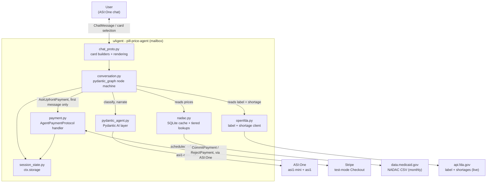
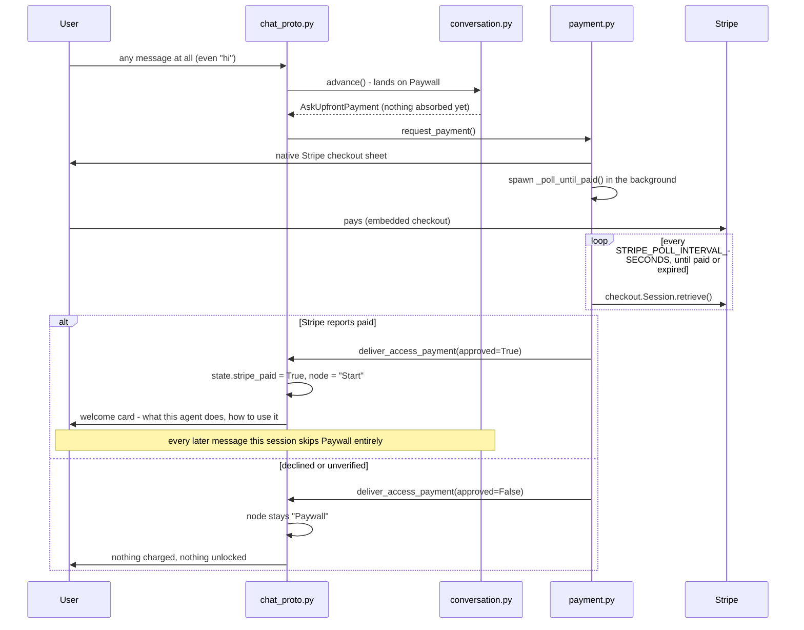

# Architecture

## Components



Two protocols mount on the same agent: `AgentChatProtocol` (`chat_proto.py`)
drives the card conversation, and `AgentPaymentProtocol` (`payment.py`) drives
the Stripe charge. Both read and write the same session record in `ctx.storage`
(`session_state.py`), which is how a payment settling on one protocol resumes a
conversation paused on the other.

The layering is strict, and it is what makes the whole machine testable offline:

- `conversation.py` decides *what to say*, as semantic `Reply` objects. It never
  builds a card, never sends a message, and never talks to Stripe.
- `chat_proto.py` decides *how it looks*. It owns every card builder, the
  selection parser, and all `ctx.send` calls.
- `nadac.py` and `openfda.py` own the data. Neither knows the conversation exists.
- `pydantic_agent.py` is the only module that calls ASI:One.

## Data access, and why the two sources are handled differently

**NADAC is bulk-cached.** CMS publishes one CSV per calendar year holding every
weekly release — 877,201 rows and 73 MB for 2026. `NadacStore.refresh()` resolves
the current download URL from the DKAN metastore (the filename embeds a rotating
release date and must never be templated), streams the CSV, filters it to curated
single-ingredient products, and loads ~112k rows into SQLite. Conversational
lookups are then plain indexed queries. The live datastore query API is used only
to resolve the release, never per user turn.

The refresh runs on startup when the cache is empty and daily thereafter. Daily
polling is nearly free because an unchanged `modified` timestamp short-circuits
before any download. CMS's actual cadence is the first Monday on or after the
15th of each month.

**openFDA is queried live.** It is built for that and needs no caching layer.

Keeping every weekly row rather than just the newest is what makes the paid
price-trend feature possible without a second data source: current price is the
row at the newest `effective_on`, and the rest is history.

## The price model

The unit of a price answer is a `PriceGroup`: one purchasable formulation, keyed
by base name + strength + dosage form + **price**.

Base name + strength + form alone is not always enough. For solid oral forms
(tablets, capsules) every NDC sharing one description at one effective date
does carry an identical price, confirmed across every tablet/capsule row
checked, so `ER`, `XR`, `ODT` and `HCL` staying in the base name is what
separates real divergence *between* formulations — `METFORMIN ER 1,000 MG
GASTR-TB` against `OSM-TAB`. But it is *not* true for liquids: confirmed live,
`IBUPROFEN 100 MG/5 ML SUSP` and every curated `.../5 ML SUSP` amoxicillin
strength carry two or three genuinely different real prices under the
identical description at the identical effective date, because bottle/package
size changes acquisition cost per mL but isn't part of the strength NADAC
publishes. `current_groups()` therefore groups by price too, so a real split
under one label becomes two correctly-priced groups instead of one group whose
price is whichever row SQLite's `GROUP BY` happened to pick when the
assumption silently didn't hold. `history()` (the price-trend feature) follows
the same principle a level deeper: it tracks one specific NDC's own price over
time rather than averaging every NDC sharing a label, for the same reason — an
average across two real, differently-priced products is a number that matches
neither of them.

A clustering run over the July 2026 file found that **every one** of the 30
curated drugs has at least one strength whose formulations disagree by more than
5%. Divergence is the normal case, not an edge case, which is why the card lists
formulations individually instead of leading with a single number. The 10%
`TIGHT_SPREAD` threshold exists for the opposite failure: without a floor,
manufacturer-level noise (atorvastatin 40 MG varies 13% between makers of the
identical tablet) would render as a meaningless range.

## The drug-info model: one label document per drug per session

`openfda.generic_name.exact` for a drug like `METFORMIN HYDROCHLORIDE` still
matches many real products - different manufacturers, and for metformin
specifically both the immediate-release and extended-release tablet, which
have genuinely different administration warnings (don't crush/split applies
to ER, not IR) and differently-numbered interaction tables. The original
`fetch_label`/`fetch_detail_sections` queried each field (`boxed_warning`,
`drug_interactions`, `adverse_reactions`, ...) independently, so each could
rank a different product's document top. Confirmed live: a "full clinical
detail" card for metformin carried a boxed warning naming the
extended-release product and, immediately after it, an interactions section
headed "Table 3: ... Metformin Hydrochloride Tablets" - the real ER label's
own interactions table is "Table 2"; "Table 3" belongs to a different,
immediate-release-only manufacturer's label entirely. Every sentence was real
FDA text; the single coherent document the card presented them as belonging
to did not exist.

The fix is `openfda.resolve_label_document()`: choose exactly one document
per drug (same priority order `fetch_label` already used - walk
`PATIENT_FIELDS`, take the first product that has one), then read every
subsequent field - the regular info card and any later "full clinical detail"
follow-up - off that one document only, via `set_id`. A field genuinely
absent on the locked document is reported missing, never filled in from a
different product. `SessionState.label_set_id` persists the choice across
turns so the info card and its detail follow-up (two separate conversation
turns, per the state machine below) describe the same product; it is cleared
wherever the drug itself changes, alongside `strength`/`groups`. The card
also names the pinned product's manufacturer and NDC, because pinning makes
the label internally consistent but does not make it universal - a user
whose own bottle is a different manufacturer, or the other formulation, is
told that plainly rather than left assuming "metformin" was one single thing.

### The problem pinning does not solve: which formulation gets pinned

Pinning stops one card from splicing two products together. It says nothing
about *which* formulation `resolve_label_document()`'s priority-walk picks
when a curated `fda_generic_name` genuinely covers more than one - and for
six of the thirty curated drugs, confirmed live by resolving a real NDC from
each side and reading `openfda.generic_name` off the actual document, it
does: metformin, gabapentin, pantoprazole, bupropion, fluoxetine and
alprazolam all have an immediate-release and an extended-/delayed-release (or,
for pantoprazole, an oral and an intravenous) product filed under the exact
same generic name. This is not cosmetic - bupropion IR/SR/XL are dosed three
times, twice, and once daily respectively with different seizure-risk framing
per formulation; fluoxetine's delayed-release product is dosed *weekly*, not
daily; pantoprazole's two documents turned out to be oral tablet vs.
IV-infusion powder, not IR vs. ER at all, confirmed by reading each
document's own `route` and `dosage_forms_and_strengths` fields.

Two other curated drugs - metoprolol, carvedilol - looked like the same
problem from NADAC pricing alone (both formulations are priced under one
curated drug) but turned out not to be: their extended-release product uses a
genuinely different salt name (`METOPROLOL SUCCINATE`, `CARVEDILOL PHOSPHATE`)
than the curated `fda_generic_name` (`METOPROLOL TARTRATE`, `CARVEDILOL`), so
`openfda.generic_name.exact` can structurally never return the other one at
all. The real gap there is coverage, not ambiguity: the info feature silently
only ever answers about the salt named in `fda_generic_name`. `Drug.also_priced_as`
names that gap on the card rather than fixing it by also querying the other
salt's generic name - a second data lookup, and a separate future change.

The fix has two parts, matched to when the formulation is actually knowable:

* **An NDC already in hand resolves the exact real product, not a guess.**
  Whenever a Tier 1 lookup or a tapped price-list formulation has put a real
  NDC into `state.groups` (`conversation._known_ndc()`), `resolve_label_document()`
  reconstructs the `labeler-product` form openFDA indexes under
  `openfda.product_ndc` and queries it directly - confirmed live to resolve
  correctly across four real metformin NDCs spanning both formulations. NDC
  width is ambiguous the same way `drugs.parse_ndc` handles on the input side
  (4-4-2 / 5-3-2 / 5-4-1 aren't distinguishable from the 11-digit NADAC form
  alone), so `openfda._product_ndc_candidates()` tries each reconstruction in
  turn. `SessionState.label_exact` records whether the pin came from a real
  NDC or a priority-walk guess, persisted alongside `label_set_id` so a later
  turn doesn't need to remember why.
* **No NDC yet is disclosed, not silently guessed.** `nadac.formulation_ambiguity()`
  checks the drug's own NADAC groups - a release-mechanism tag (`ER`/`XR`/`SR`/
  `CR`/`DR`) on some but not all base names, or a non-oral form (`VIAL`/`INJ`)
  alongside an oral one - deliberately checked against pricing data already
  cached locally rather than against whatever document got resolved, because a
  plain immediate-release label almost never uses the words "immediate
  release" in so many words; only the special formulation names itself, so
  detecting ambiguity from label text alone would miss exactly the case where
  resolution landed on the ordinary side. When it's true and no NDC pinned the
  choice, the `dosage_and_administration` section (added to `DETAIL_FIELDS`
  for this - dosing frequency wasn't surfaced anywhere before) carries a plain
  caveat naming what the resolved document's own `route`/dosage text actually
  says, placed on that section specifically rather than as a footnote spread
  across the card.

## Three bugs found in a full re-audit, none touched by the pinning work above

A later pass re-checked every card's information against live data rather
than re-reading the pinning logic, and found three real, previously-shipped
defects unrelated to formulation pinning:

* **`brand_vs_generic()` was structurally unable to return a row for any
  drug, ever.** `_curated_rows()` only kept a CSV row whose description
  started with the curated *generic* name (`nadac_prefix`) - but a brand
  row's own description is its trade name (`LIPITOR 40 MG TABLET`, never
  `ATORVASTATIN...`), so no brand row could reach the cache regardless of
  what CMS published. Confirmed live: the production cache held zero
  `classification = 'B'` rows out of 119,449, while the raw file has 75,287,
  including real, current rows for 19 of the 30 curated drugs (Lipitor,
  Xanax, Crestor, Synthroid and 15 others). Every "Brand vs generic" result
  users saw was "no priced brand equivalent," indistinguishable from a
  genuine data gap (which is real for some drugs - Advil, Glucophage, Coreg
  are confirmed absent from the file entirely) but was actually this bug for
  most of them. Fixed by also matching each drug's own `brands` names as a
  fallback prefix in `_curated_rows()` - but a brand-name match needed the
  same discipline as the generic-name pinning work: confirmed live, the
  brand `"toprol"` is also a strict prefix of `"TOPROL XL ..."`, the real
  succinate-ER brand name, a different salt this drug's own `also_priced_as`
  already flags as not covered by its curated tartrate. `_brand_match_is_safe()`
  rejects that specific match (the word right after the brand prefix being a
  release tag) for the two drugs already flagged with `also_priced_as`, while
  leaving same-salt brand matches (Wellbutrin SR for bupropion, confirmed one
  salt) unaffected. `current_groups()` and `strengths()` now filter to
  `classification = 'G'` explicitly, so a loaded brand row - now that any
  exist - cannot leak into the plain generic price list; `by_ndc()` (Tier 1,
  an exact NDC off a real bottle) stays unfiltered, since a user's own bottle
  can legitimately be a brand product.
* **That same fix, tested against real data, surfaced a second bug**:
  `brand_vs_generic()`'s grouping included `generic_per_unit` as part of the
  `GROUP BY` key, on the assumption a formulation has one such value. It
  doesn't: `corresponding_generic_drug_nadac_per_unit` is re-surveyed weekly
  independent of whether the brand's own price changed, confirmed live for
  one real Lopressor NDC whose own `effective_on` held constant for months
  while this companion field carried seven different values across weekly
  snapshots - producing seven near-duplicate "price splits" for one product
  that never actually changed price. Fixed by picking only the most
  recently-surveyed value (`MAX(as_of)`) per formulation instead of grouping
  on it.
* **The plain price list for metoprolol and carvedilol silently mixes two
  different salts, with no disclosure at all** - a distinct problem from the
  FDA-info coverage gap `also_priced_as` was written for. NADAC's own
  description for the *other* salt's extended-release product
  (`METOPROLOL SUCC ER ...`, `CARVEDILOL ER ...`) still starts with the
  curated plain-salt prefix, so `current_groups()` cannot tell it apart from
  a real same-salt release option (which is exactly what that same pattern
  correctly identifies for metformin). Confirmed live: a Tier 3 "what does
  carvedilol cost" lists $0.017-0.032/unit tablets beside $5.66-6.68/unit
  capsules - a >150x gap - with the existing "these are different products"
  messaging framing it as ordinary formulation variation, saying nothing
  about it being a different salt with its own separate FDA label.
  `nadac.other_salt_groups()` (the release-tag test, scoped only to drugs
  with `also_priced_as` set) now backs a disclosure on both the price-list
  card and the narration facts naming the other product by the same phrase
  `also_priced_as` already uses on the info card.

None of these were caught by the existing test suite because every prior
test seeded `NadacStore` by inserting rows directly into SQLite, bypassing
`_curated_rows()` - the actual CSV-parsing path - entirely. `tests/test_nadac.py::TestCuratedRowsLoading`
now runs that real path against a synthetic CSV shaped like the live file.

## Two more bugs found by tracing a live transcript against the pinning claim above

A follow-up audit re-ran the exact scenario the metformin IR/ER pinning fix
was verified against - not by re-reading the code, but by comparing a real
user transcript against what `live_check.py` had actually exercised for its
"Tier 1" claim. That comparison surfaced two further defects, both real and
both distinct from the splicing bug above:

* **NDC recognition had no deterministic fallback, unlike drug-name
  recognition - a genuine single point of failure for the one feature this
  agent's own README calls "no ambiguity."** `Start.run()` only ever parsed
  an NDC out of the raw message when `intake.ndc_text` was already
  non-empty - i.e. only when the `asi1-mini` classifier itself had already
  flagged the message as containing one. Drug names have a real backstop for
  the equivalent failure (`drugs.resolve(deps.text)`, run unconditionally as
  a "the model can miss a name it was handed verbatim" safety net); NDCs did
  not. `AskDrug.run()` does call `drugs.parse_ndc(deps.text)` unconditionally,
  but `Start.run()` only ever routes there when `state.drug_key is None` -
  once any drug is already active in a session (the ordinary case after the
  first turn), that path is unreachable, and a classifier miss on a
  natural-language-wrapped NDC (confirmed capable of happening, though not
  reproduced on every run - `asi1-mini` is not deterministic) silently fell
  through to whatever drug/strength was already in state instead of the real
  product, with no error shown. `live_check.py`'s own "Tier 1" test never
  caught this because it hand-constructs `ai.Intake(ndc_text="...")` directly
  rather than running the text through the real classifier - it proved the
  *pinning* logic correct once an NDC is recognized, but never exercised
  recognition itself. `Start.run()` now also runs `drugs.parse_ndc(deps.text)`
  unconditionally whenever `intake.ndc_text` was empty, mirroring the
  drug-name backstop; `drugs.parse_ndc`'s pattern (three separated digit
  groups, or exactly 11 bare digits) is specific enough that running it on
  arbitrary free text carries no meaningful false-positive risk.
* **The pinning fix's own provenance display could show a different NDC than
  the one actually pinned from.** Confirmed live: a document is not always
  one NDC - a real Mylan metformin ER document legitimately lists two
  package-size NDCs (`0378-6001` and `0378-6002`, same manufacturer, same
  formulation, one SPL) under `openfda.product_ndc`. `_section()` displayed
  `ndcs[0]` unconditionally, so tapping the `0378-6002` formulation from a
  price list and asking for its label showed "NDC 0378-6001" in the
  provenance note - the *document* was exactly right (`matched_by_ndc=True`,
  correct manufacturer, correct formulation), but the specific package NDC
  named as "the exact product this text came from" wasn't the one actually
  queried. Compounding this, `LookupInfo.run()` only ever passed `ndc=` to
  `resolve_label_document` on the *first* call for a drug (the one that
  chooses `state.label_set_id`); every subsequent call - the far more common
  case, since every info/detail request after the first for the same drug
  re-fetches by `set_id` alone - never passed `ndc=` at all, so the new
  `_preferred_ndc()` fix had nothing to prefer on the call that actually
  renders the card. Fixed on both sides: `_preferred_ndc()` shows the package
  NDC matching one of `_product_ndc_candidates(ndc)` when present in the
  document's own list, falling back to index 0 only when no query NDC is
  known at all; `LookupInfo.run()` now passes `_known_ndc(state)` on every
  call, not just the first. `resolve_label_document` checks `set_id` before
  `ndc` when both are given (previously `ndc` was unconditionally first) so
  that passing `ndc` on every call doesn't add 1-3 redundant openFDA requests
  once the document is already pinned - `set_id` alone still decides which
  document, `ndc` now only ever affects which of that document's own listed
  packages is displayed.

Confirmed live, end to end, after both fixes: with a drug already active in
`state` and a hand-simulated classifier miss (`ndc_text=None`) on "I saw this
NDC please check 27241-0241-90", the turn still resolves Tier 1 to the exact
`METFORMIN ER 1,000 MG GASTR-TB` product. Tapping `METFORMIN ER 500 MG
OSMOTIC TB` (example NDC `00378600291`) from a price list and then asking for
the label now shows `product_ndc=0378-6002` - a member of that NDC's own
candidate set - instead of the sibling package `0378-6001`; a follow-up "full
clinical detail" request on the same session shows the same NDC on every
section.

## Conversation state machine

`conversation.py` uses `pydantic_graph`'s `BaseNode`, `GraphRunContext` and `End`
— the primitives that survived into v2 and are not deprecated — but drives the
machine itself. `pydantic_graph` 2.x removed its persistence package outright and
has no resumable runner, so position and state live in `ctx.storage` instead.
That was the intended design anyway: two competing state stores would be a bug
waiting to happen.

A node either returns the next node, which runs immediately in the same turn, or
calls `pause()`, which records where to resume and ends the turn. Making the
pause explicit is what lets "present a card, then wait" be one node.

```
Paywall ──┬─ already stripe_paid ───────────► Start
          └─ not yet paid ─────────────────► AwaitingAccessPayment (wait)

Start ──┬─ NDC present ─────────────────────► LookupPrice
        ├─ no drug recognised ──────────────► AskDrug          (wait)
        ├─ intent info / more_detail ───────► LookupInfo
        ├─ intent price_trend ──────────────► RunPriceTrend
        ├─ intent brand_compare ────────────► RunBrandCompare
        └─ otherwise ───────────────────────► LookupPrice

LookupPrice ──┬─ no quantity ───────────────► AskQuantity      (wait)
              ├─ unknown NDC / strength ────► AskDrug          (wait)
              └─ resolved ──────────────────► ShowPrices       (wait, renders)

ShowPrices ───┬─ group tapped ──────────────► ShowPriceDetail  (wait, renders)
              ├─ "price_trend" tapped ──────► RunPriceTrend
              ├─ "brand_compare" tapped ────► RunBrandCompare
              ├─ "$45" quoted ──────────────► ShowPrices       (comparison)
              └─ anything else ─────────────► Start

LookupInfo ─────────────────────────────────► ShowInfo         (wait)
RunPriceTrend / RunBrandCompare ────────────► ShowPrices       (wait, renders result)
```

Every fresh session starts at `Paywall`, not `Start` - a bare "hi" is gated
exactly like a real drug question. `AwaitingAccessPayment` is resumed by
`payment.py`, not by a chat message. Once `stripe_paid` is set, `Paywall` steps
straight to `Start` and is never visited again for the rest of the session;
`RunPriceTrend`/`RunBrandCompare` are then just two more free lookups, run
directly with no per-feature approval step.

## Where Pydantic AI fits

Two agents in `pydantic_agent.py`; everything else is plumbing.

| Agent | Model | Feature | What it's for |
| --- | --- | --- | --- |
| `intake_agent` | `asi1-mini` | `output_type=Intake` | Classify the turn and extract drug, strength, NDC, quantity. |
| `narrate_agent` | `asi1` | `output_type=str` | Write the paragraph above the price card. |

The split follows the cost of being wrong. Extraction errors are caught
immediately by the user; phrasing a price range honestly is where reasoning
quality actually shows. There is no third, payment-gated agent: since one
upfront charge unlocks the whole session, price trend and brand-vs-generic are
plain, deterministic reads off `NadacStore` - `RunPriceTrend`/`RunBrandCompare`
in `conversation.py` call `nadac.history()`/`nadac.brand_vs_generic()` directly,
with no LLM call and no approval step in between.

Two things are deliberately kept away from the models:

- **The medical boundary** is a regex in `crosses_medical_boundary`, checked
  before any model call on every turn. A classifier that is right 99% of the time
  is not an acceptable gate on "should I take this?".
- **Every number** is computed in `nadac.py` and rendered into the card by
  `chat_proto.py`. The narrator receives them as fixed facts and is told not to
  derive new ones, so a loose sentence cannot contradict the card beneath it.

Drug information is never paraphrased at all. `openfda.readable` normalises
whitespace and paragraph breaks and does nothing else.

## The payment gate

One upfront Stripe charge unlocks the whole agent for the session - there is no
free tier and no separate per-feature charge. The very first message of a
session, whatever it is, hits `Paywall` before any drug or intent processing;
`price_trend` and `brand_compare` are not gated a second time once that charge
has cleared. The Stripe mechanics (`create_checkout_session`, `verify_paid`,
the `CommitPayment`/`RejectPayment` handlers) are still structurally
`shipping-label-agent/payment.py`; what changed is what the outcome does.



**Hard stop on decline.** There is no reduced free tier to fall back to -
before payment, nothing works, not even a price check. A decline just re-arms
`Paywall`, so the next message asks again.

**Per chat window, not per address forever.** `stripe_paid` lives in the same
`SessionState` as everything else, so `check_new_window_and_reset`
(`session_state.py`) clears it exactly like it clears drug selection or
quantity: a brand-new ASI:One chat window starts back at `Paywall`, even for a
sender address that paid in a previous window.

**Confirmation is polled, not just pushed.** The reference (and the first cut
of this agent) relied on ASI:One relaying `CommitPayment`/`RejectPayment` back
to the seller once the embedded checkout completes. Confirmed live: for a fully
paid test-mode checkout, that message never arrived - `on_commit` never fired,
even minutes later - so the only way to unlock was the user typing "paid" to
trigger `confirm_payment_via_text` manually. `request_payment` now also spawns
`_poll_until_paid`, which checks the same Stripe endpoint every
`STRIPE_POLL_INTERVAL_SECONDS` (default 4s) directly, independent of whatever
ASI:One does or doesn't relay. The result: the agent unlocks on its own within
a few seconds of the checkout clearing. `on_commit`/`on_reject` and the manual
"paid" fallback stay in place - whichever path resolves first wins, and
clearing `state.stripe_session_id` on delivery (`chat_proto.py`) stops the
others from re-delivering after the fact.

There is no refund path in this design: the charge is a flat, one-time access
fee, not a per-analysis charge that can come back empty. If `RunPriceTrend` or
`RunBrandCompare` finds nothing for a particular drug (too little survey
history, or no priced brand equivalent), it just says so - the user already
has full access either way, so nothing was charged for that specific result in
the first place.

## Directory layout

```
pydantic-agent/pill-price-agent/
  agent.py           uAgent entry point; test-key assertions; refresh schedule
  chat_proto.py      Card builders, selection parsing, reply rendering
  conversation.py    The node machine and its semantic Reply types
  pydantic_agent.py  Pydantic AI agents; the medical boundary
  payment.py         AgentPaymentProtocol handler; Stripe test-mode checkout
  nadac.py           Metastore resolution, CSV refresh, SQLite cache, lookups
  openfda.py         Label fallback chain and shortage cross-check
  drugs.py           Curated list, combo filter, brand and strength parsing
  session_state.py   ctx.storage read/write, new-window reset
  verify_drugs.py    Clustering + openFDA check; run before adding a drug
  live_check.py      Every path against the real APIs, no mocks
  tests/             Offline suite (TestModel/FunctionModel + MockTransport)
```
